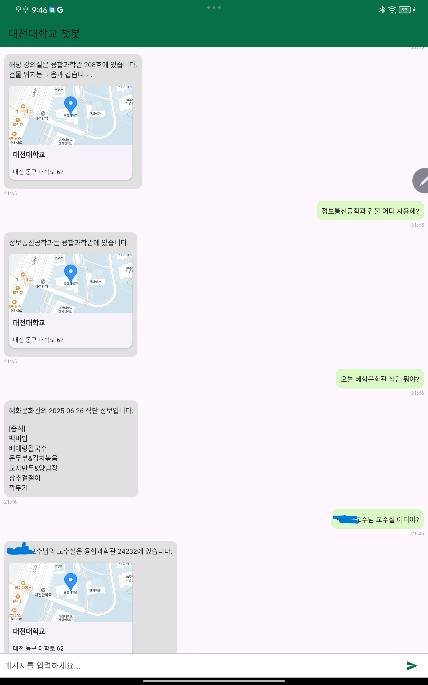

_# 프로젝트명: 대전대학교 대학 챗봇 

## [1] 프로젝트 개요 및 기간

본 프로젝트는 대학 내 정보 접근성을 높이기 위한 AI챗봇 시스템을 개발하는 것을 목표로 하였습니다.
사용자는 Flutter 기반 모바일 애플리케이션을 통해 교수실 정보, 프린터기 위치, 식단 정보, 강의실 위치 등 챗봇에게
질문을 할 수 있으며, 챗봇은 이를 이해하고 정확한 정보를 제공합니다.

자연어 처리는 Rasa 프레임워크를 기반으로 하여 학과명, 교수명 등 도메인 특화된 발화를 인식하고 
/mdel/parse 엔드 포인트를 통해 서버와 연동됩니다.

백엔드는 java + spring으로 구성되었으며, 사용자 질문을 Rasa에 전달하고 인텐트/엔티티를 파싱한 뒤
해당 정보를 바탕으로 데이터베이스에서 필요한 정보를 조회하여 사용자에게 응답합니다.

- **진행 기간**: 2025.03.13 ~ 2025.06.25
- **담당역할**:
    - RESTful API 설계 및 구현 (Spring Boot 기반)
    - 데이터베이스 모델링 및 MariaDB 와 MongoDB 연동
    - Rasa 프레임 워크를 통해 추출된 인텐트를 전략 패턴을 통해 구분하여 적절한 응답하는 로직 구현
    - 사용자 앱에 전체적인 대화 기록을 전달하는 로직 구현

---

## [2] 기술 스택
 - 언어: dart, java, python
 - 프레임워크: Flutter, Spring Boot, Rasa
 - 빌드 도구: Gradle
 - 데이터베이스: MariaDB, MongoDB
 - 보안: jasypt

  ---

## [3] 데이터 모델링

MariaDB


MongoDB
```document
{
    "_id": "ObjectId",
    "deviceId": "String",
    "timestamp": "DateTime",
    "messageType": "String",
    "text": "String"
}
```

- **데이터베이스 스키마**: 
    - MariaDB: 학과, 교수, 건물, 시설(atm,프린터기,교내매점,편의점,교내카페), 식당 정보 테이블
    - MongoDB: 대화 기록 저장을 위한 컬렉션

--- 
## [4] API 문서


- **채팅 API**


## [5] 실행 화면



## [6] 고민 사항 및 해결 방안

### 설계 부분

#### Rasa 프레임워크 vs ChatGPT API

  처음에는 rasa 프레임워크를 사용하려고 했습니다. rasa는 도메인 특화된 자연어 처리에 좋으며 무료라는 점이 좋았습니다.
  chatgpt api는 1M 토큰당 2달러이며 여러차레 좋다고 검증받은 범용 모델이라는 점이였습니다. 저는 교내 정보를 제공하는 챗봇을 개발하고 싶었고
  chatgpt api는 특정 도메인에 최적화 되어있지않는 모델이기에 한계가 있다 판단하여 특정 rasa 프레임워크를 사용했습니다.

#### rasa의 엔드포인트인 model/parse 와 /webhooks/rest/webhook

  /webhooks/rest/webhook 엔드포인트로 사용자에게 질문을 전달하면 현재 제공하는 기능과 동일한 응답을 하지만
  저는 향후 확장성을 고려하여 model/parse 엔드포인트를 사용했습니다.
  model/parse 엔드포인트는 인텐트와 엔티티를 추출하여 여러 로직에 응용할 수 있지만
  /webhooks/rest/webhook 엔드포인트는 단순 응답만 제공하기에 챗봇으로 이용한 기능을 추가하는데 제한이 있다고 판단했습니다.

### 구현 부분

설계한 이후 /model/parse 엔드포인트에 요청하면 json이 어떤 응답 형태로 오는지 알기위해서 알아보았고 아래와 같이 온다는 것을 알았습니다
```json
{
  "text": "내일 점심 뭐야?",
  "intent": {
    "id": null,
    "name": "ask_meal",
    "confidence": 0.9876
  },
  "intent_ranking": [
    {
      "id": null,
      "name": "ask_meal",
      "confidence": 0.9876
    },
    {
      "id": null,
      "name": "ask_dinner",
      "confidence": 0.0123
    }
  ],
  "entities": [
    {
      "entity": "date",
      "start": 0,
      "end": 2,
      "value": "내일",
      "extractor": "DIETNER",
      "confidence_entity": 0.998
    }
  ]
}

```
저는 intent를 구분하여 엔티티 값을 가져와 데이터베이스 조회하여 응답하는 로직을 구현하려고 했습니다. 여기서 intent를 구분하기 위해 고민을 했습니다.
단순 if문을 사용하여 intent를 구분할 수도 있지만, 여러 intent에 따라 수많은 if문을 작성해야해서 흐름을 파악하기 어렵다는 가독성 문제와
intent가 추가될 때마다 if문을 추가해야한다는 유지보수성 측면에도 비효율적이라 판단했습니다. 

이에 수많은 고민 끝에 전략패턴과 팩토리 패턴을 결합하여 intent를 처리하는 구조로 설계 방향을 결정하였습니다.
팩토리 패턴을 통해 intent 이름을 key로 하여 해당 intent에 대응하는 전략객체를 자동으로 매핑하고 주입 받을 수 있는 구조로 만들었고,
전략 패턴을 통해 intent 별로 분리된 객체가 자신의 역할에 맞는 로직을 수행하도록 하였습니다. 이렇게 함으로써 각 intent에 대한
처리 책임을 객체로 분리하였습니다.

그렇게 구현을 하다보니 단일 엔티티만을 처리하는 전략의 경우, 엔티티 값을 추출하는 로직이 각 클래스에서 반복적으로
구현되는 문제가 있었습니다. 이처럼 중복된 로직을 매번 구현하는 것은 비효율적이라 판단하여, 공통 처리 로직을 상위 추상 클래스
인 `AbstractIntentStrategy`에 정의하고, 이를 상속받는 각 전략 클래스는 빈 생성시 의존성 주입과정에 super()을 호출하여
상위클래스의 필드값을 초기화 하였습니다. 이후 `RasaService` 에서는 handle() 메서드를 통해 공통된 흐름
(엔티티 추출 -> 검증 -> 위임)을 실행하게 하고 실제 전략 클래스에서는 오직 엔티티 값에 대한 개별 처리 로직만을 구현하도록 구성했습니다.

